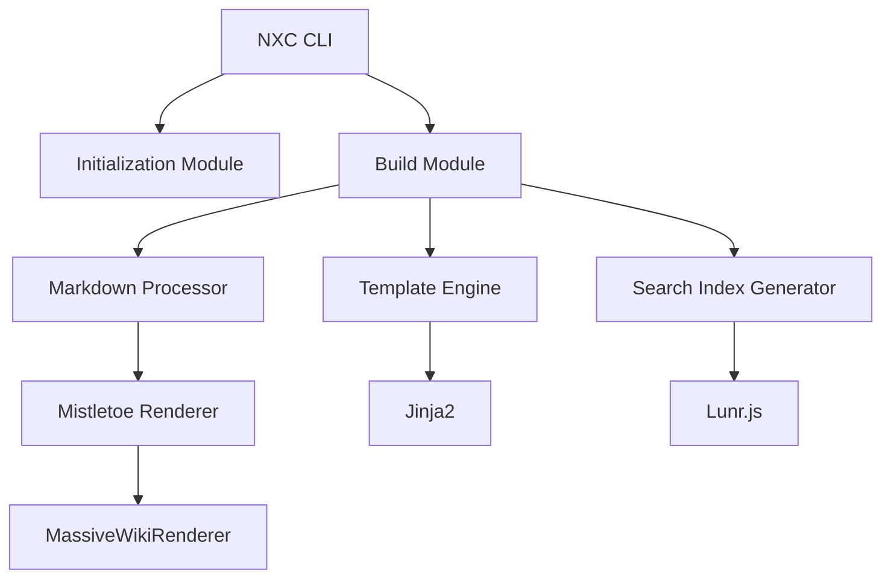
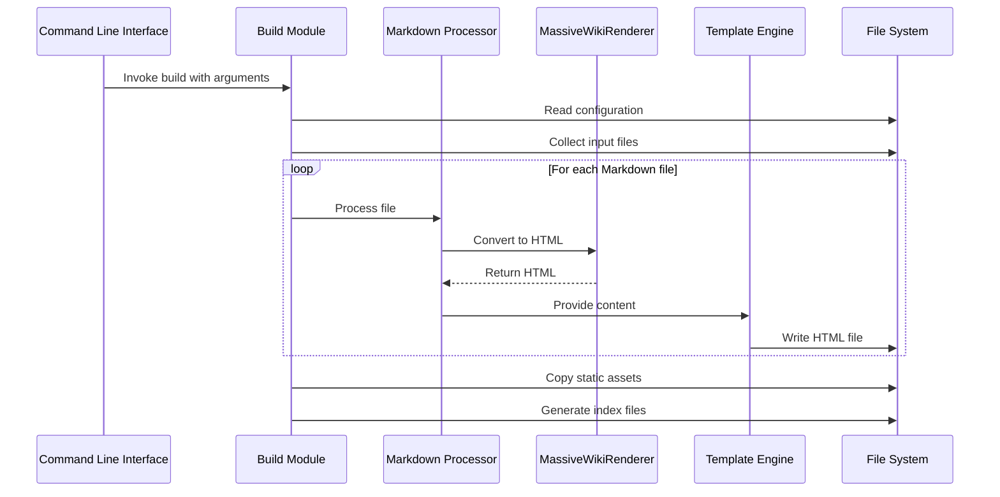
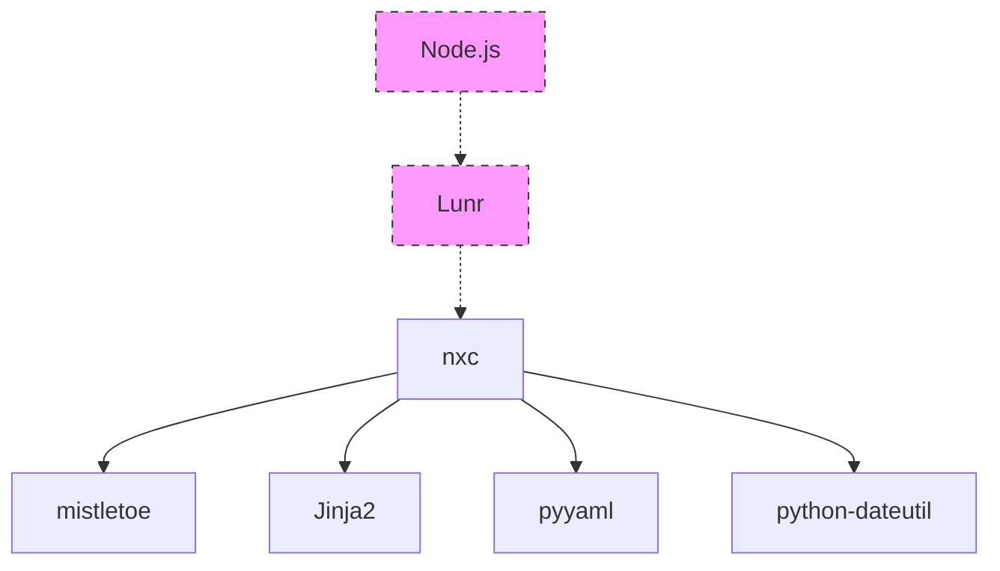

# NXC Architecture

This document provides an overview of the NXC (Massive Wiki Builder) architecture, detailing the core components and their interactions.

## Core Components

NXC consists of several key components that work together to transform Markdown files into a static website:



### 1. Command Line Interface (CLI)

The entry point for user interaction, handling command-line arguments and dispatching to the appropriate functionality:

- Subcommands: `init` and `build`
- Arguments processing
- Configuration validation

### 2. Initialization Module

Responsible for setting up a new wiki site:

- Creating directory structure
- Copying template files
- Generating initial configuration
- Setting up themes

### 3. Build Module

The core engine that transforms Markdown files into HTML:

- File collection and processing
- Wiki link resolution
- Template rendering
- Static asset copying
- Search index generation (optional)

### 4. Markdown Processor

Handles parsing and transformation of Markdown content:

- Front matter extraction
- Wiki link detection
- Transclusion processing

### 5. Custom Renderer

Extensions to the Mistletoe Markdown parser:

- `MassiveWikiRenderer`: Custom renderer for wiki links
- Link transformation
- Image processing
- Transclusion handling

### 6. Template Engine

Uses Jinja2 to render HTML templates:

- Page templates
- Layout components
- Navigation elements

## Directory Structure

```
nxc/
├── __init__.py
├── nxc.py                  # Main entry point
├── mistletoe_renderer/     # Custom Markdown renderer
│   ├── __init__.py
│   ├── massivewiki.py      # Wiki link processor
│   ├── render.py           # Rendering utilities
│   └── test.py             # Tests
└── templates/              # Default templates
    ├── Sidebar.md
    ├── gitignore-template.txt
    ├── netlify.toml
    ├── nxc-template.yaml
    ├── package.json
    ├── requirements.txt
    └── this-website-themes/
        └── dolce/          # Default theme
```

## Module Interactions



## Extension Points

NXC is designed with several extension points:

1. **Templates**: Custom themes can be created by providing alternative templates
2. **Renderers**: The custom renderer can be extended for additional markdown features
3. **Configuration**: The YAML configuration allows customization of site behavior

## Dependency Architecture



Core Python dependencies:
- mistletoe: Markdown parsing
- Jinja2: HTML templating
- pyyaml: Configuration parsing
- python-dateutil: Date handling

Optional dependencies:
- Node.js and Lunr: Full-text search functionality