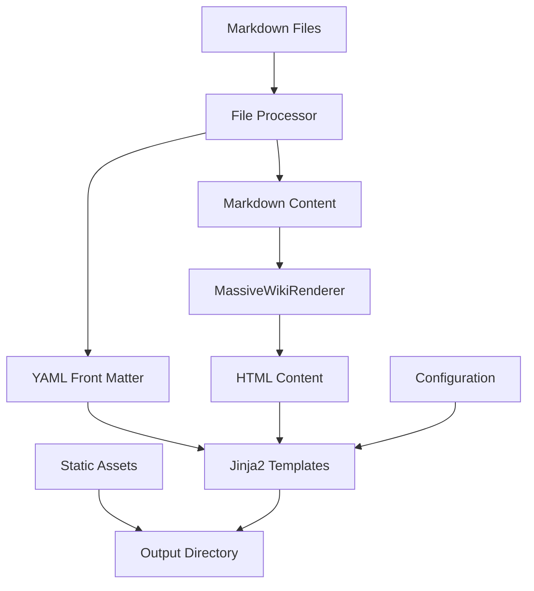
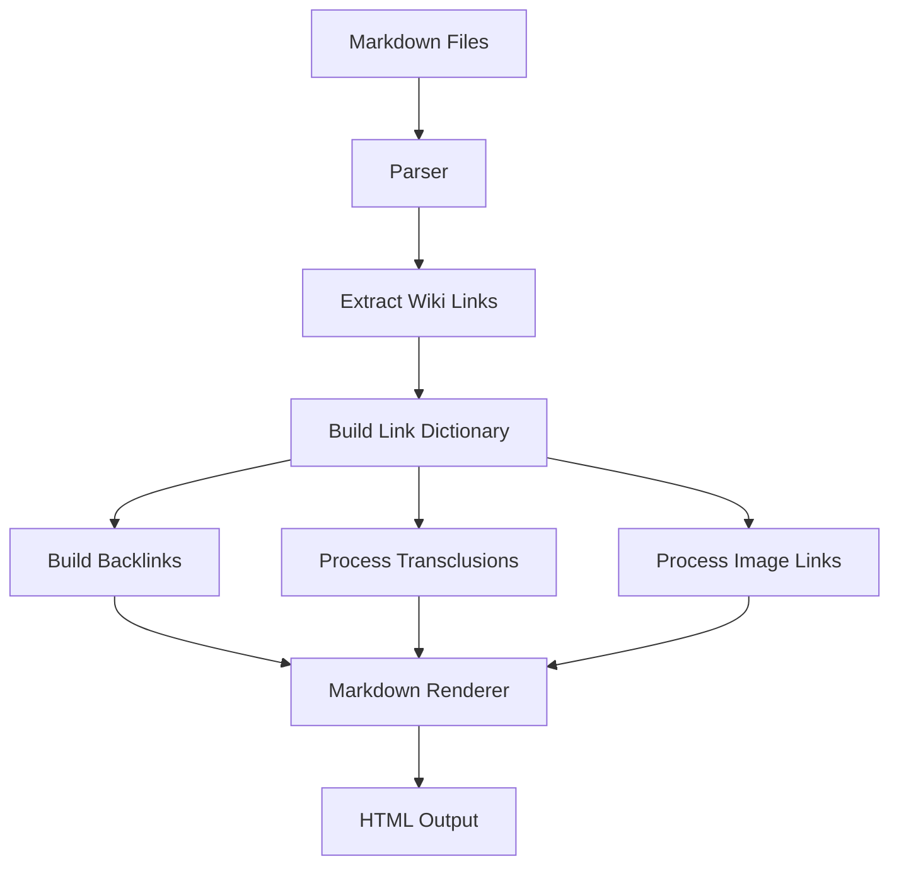
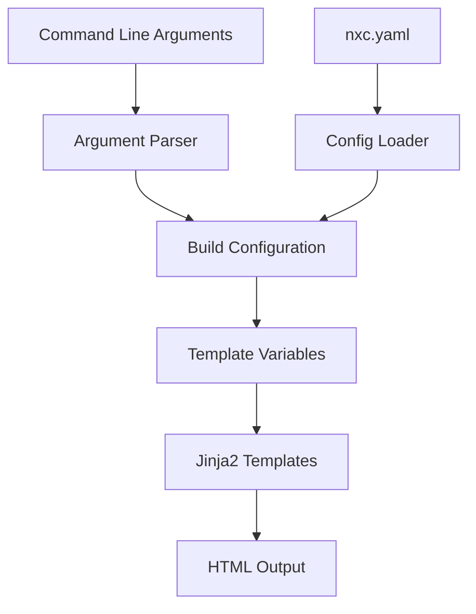
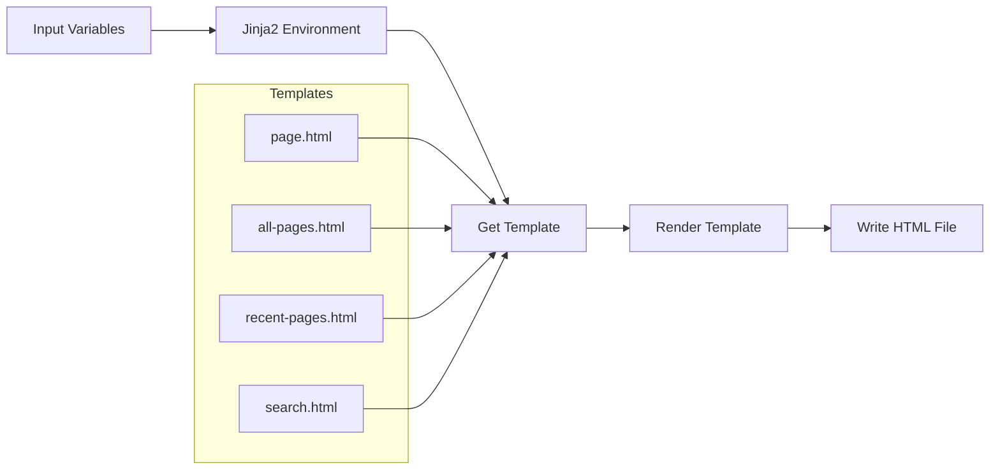
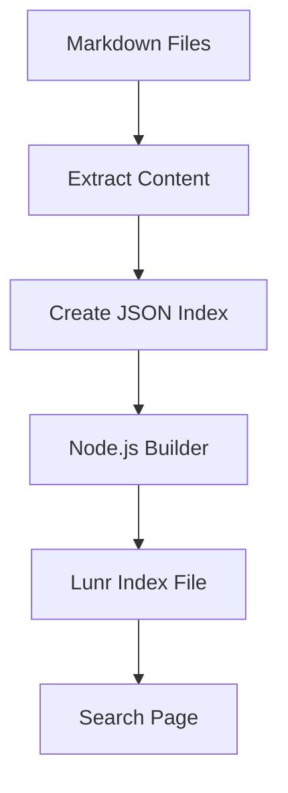
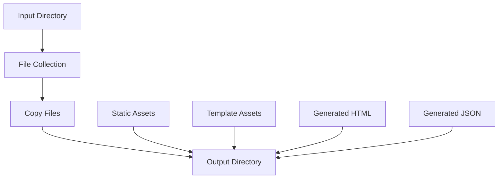

# NXC Data Flow

This document describes the data flow in the NXC (Massive Wiki Builder) system, showing how information moves through the system during the build process.

## Overall Data Flow

## Wiki Links Processing

The wiki links processing involves several steps:
1. Extract all wiki links from Markdown files
2. Create a dictionary mapping link targets to file paths
3. Build a backlinks table for each page
4. Process special link types (transclusions, images)
5. Render links as HTML with appropriate classes and attributes

## Configuration Flow

## Template Rendering Process

## Search Index Generation

When the `--lunr` flag is used, NXC generates a search index:
1. Extract content from all Markdown files
2. Create a JSON data structure for indexing
3. Pass this to a Node.js script that uses Lunr
4. Generate JavaScript files for the search functionality
5. Include these in the search page

## File System Operations

The file system operations include:
1. Collecting all files from the input directory
2. Copying non-Markdown files directly
3. Copying static assets from templates
4. Writing generated HTML and JSON files