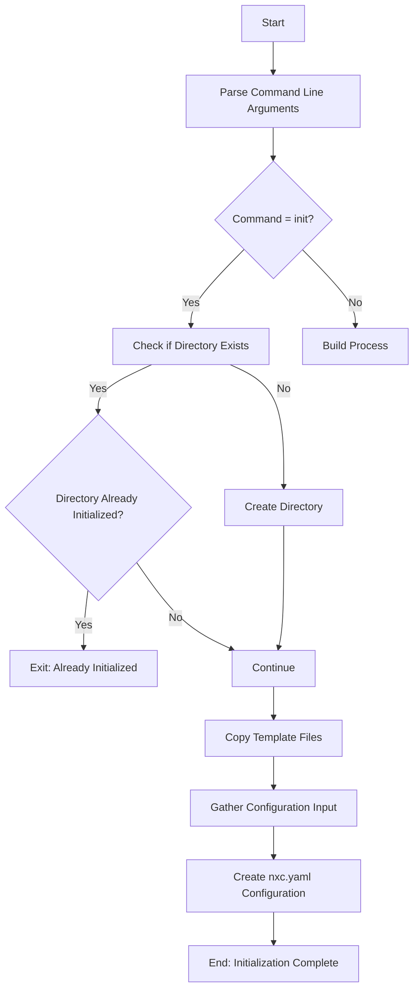
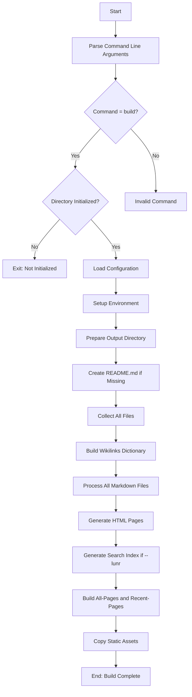
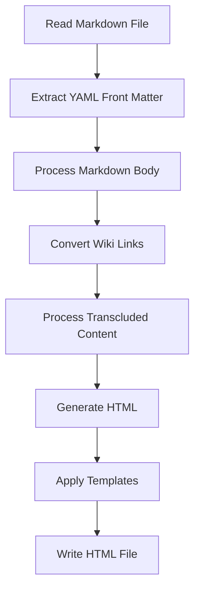
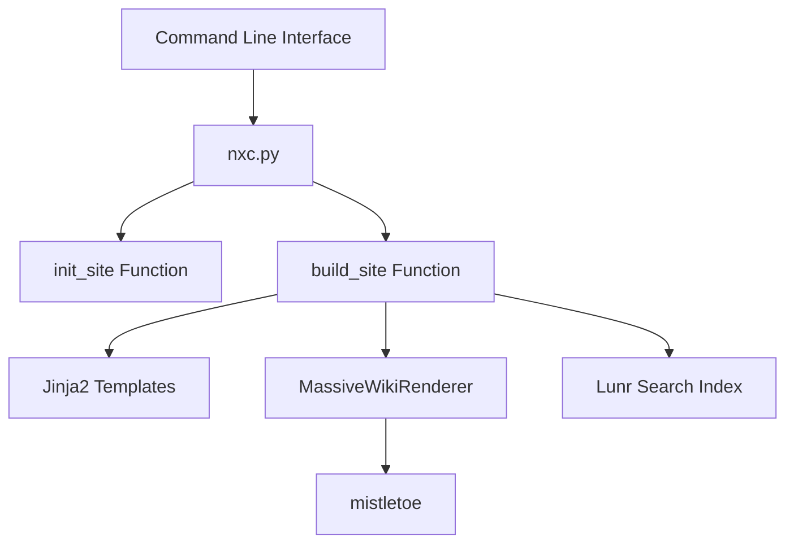

# NXC Workflow

NXC (Massive Wiki Builder) follows two main workflows: Initialization and Build. This document outlines the process and components involved in each.

## Initialization Workflow

Key components during initialization:
1. Directory validation and creation
2. Template file copying (templates, themes, configuration)
3. User input collection (website title, author, Git repository)
4. Configuration file creation (.nxc/nxc.yaml)

## Build Workflow

Key components during build:
1. Configuration loading
2. File collection and wiki link processing
3. Markdown to HTML conversion
4. Template rendering with Jinja2
5. Search index generation (optional)
6. Static asset copying

## Markdown Processing Workflow

## Wiki Link Types

NXC supports several types of wiki links:

1. **Regular Wiki Links**: `[[Page Name]]` or `[[Page Name|Display Text]]`
2. **Image Links**: `![[image.png]]` or `![[image.png|Alt Text]]`
3. **Transclusion Links**: `![[Page Name]]` (includes content from another page)

## Component Architecture

The nxc package integrates several components:
- Command-line interface for user interaction
- File system operations for reading/writing files
- Markdown parsing and HTML rendering
- Wiki link processing
- Template rendering with Jinja2
- Optional search index generation with Lunr